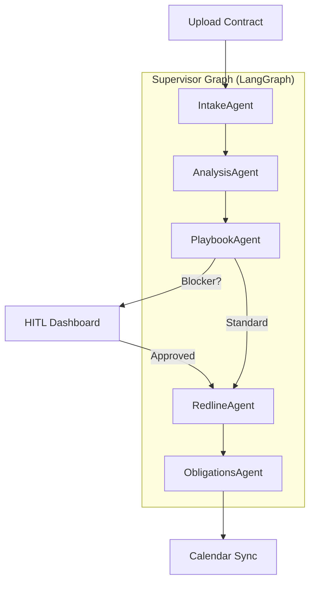

# Legal Contract Agent ⚖️🤖

> **The autonomous senior associate for contract review, redlining, and obligation tracking.**

`legal-contract-agent` is a production-grade, open-source AI agent that reads, analyzes, redlines, and tracks contracts the way a senior in-house counsel does—but at the speed of software.

---

## 🚫 Disclaimer

**Legal-contract-agent produces legal *information* and *drafts*, not legal *advice*.**  
It is a tool for lawyers and informed business users, not a replacement for licensed counsel. The system automatically refuses to make final decisions on high-stakes terms (indemnification caps, liability ceilings, IP assignment) and requires human-in-the-loop (HITL) approval for all blocker deviations.

---

## 🚀 90-Second Demo

1.  **Upload** a vendor MSA or NDA.
2.  **Classify & Parse**: System identifies the contract type and structures every clause with sub-second accuracy.
3.  **Analyze**: Material terms (Liability, IP, Term, Renewal) are extracted into a grounded TermSheet.
4.  **Audit Playbook**: Terms are compared against your corporate playbook.
5.  **Redline**: A native Word (.docx) redline is generated with tracked changes and clause-anchored comments.
6.  **Alert**: Renewal dates and termination notice windows are synced to your calendar.

---

## 🏗️ Architecture



---

## 🛡️ Safety Model

-   **Blocker Gates**: Any deviation from the playbook flagged as "High" or "Blocker" halts the pipeline until a human reviews it in the dashboard.
-   **Structural Disclaimers**: Every API response, redline footer, and email draft contains a machine-readable and human-visible disclaimer.
-   **Grounding Guardrail**: Every claim AI makes about a contract is cited to exactly (Page, Section, Bounding Box). Hallucinated references are blocked at the output layer.
-   **Self-Hosted Default**: Designed for sensitive legal workloads—all data stays in your infrastructure.

---

## 🛠️ Capability Table

| Agent | Responsibility | Key Tech |
| :--- | :--- | :--- |
| **Intake** | Parsing & Classification | PyMuPDF, python-docx, PaddleOCR |
| **Analysis** | Term Extraction & Risk | Claude 3.5 Sonnet, Instructor |
| **Playbook** | Standard Comparison | YAML-based Negotiated Playbooks |
| **Redline** | Native XML Tracked Changes | python-docx + lxml |
| **Obligations** | Notice & Renewal Alerts | iCalendar, Google Calendar API |

---

## 📦 Quickstart (Docker)

```bash
# Clone the repository
git clone https://github.com/rouviour-german/legal-contract-agent
cd legal-contract-agent

# Start the full stack (FastAPI + React + Postgres + Redis)
docker-compose up --build
```

---

## 📂 Project Structure

- `legal_agent/`: Core Python micro-agents and LangGraph orchestration.
- `dashboard/`: React-based HITL approval queue and contract viewer.
- `parse/`: Expert-level PDF/DOCX parsing (layout aware).
- `redline/`: Native Word XML revision-mark generation.
- `playbook/`: Structured position management (Playbook Positions).

---

## ⚖️ License

Distributed under the Apache-2.0 License. See `LICENSE` for more information.

---

## Author & Contact

- **GitHub:** [@rouviour-german](https://github.com/rouviour-german)
- **Email:** [rouviourgermanmeetings@gmail.com](mailto:rouviourgermanmeetings@gmail.com)
- **Profile:** https://github.com/rouviour-german

